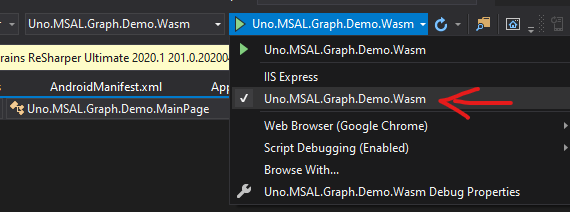

# Demo App for `Uno.UI.MSAL` (extensions to MSAL.NET for Uno Platform)

This is a demo app for the usage of MSAL.NET into a Uno app, illustrating the usage for Uno-Wasm.

## Quick Start: Use your own Azure App Registration on Wasm

The code is already including an App ID your can use to try the app locally. You should also try to register your own Azure AD application.  Here's the instructions:

1. Go to Azure Portal, on your Azure AD resource

2. Open "App registrations" tab & create a new registration

3. Type a name, select account types you want (which kind of accounts can access this app)

4. For "Redirect URI", choose "Single-page application" and type `http://localhost:5000/authentication/login-callback.htm`

5. In your new app _Overview_ page, take note of the `Application (client) ID` and `Directory (tenant) ID`

6. Open the solution in Visual Studio, open the `Uno.MSAL.Graph.Demo.Shared` project and locate & open the `MainPage.xaml.cs` file (nested under the `MainPage.xaml`).

7. Replace the `CLIENT_ID` & `TENANT_ID`

8. Right-click on the `Uno.MSAL.Graph.Demo.Wasm` project and `Set as Startup Project`

9. In the top bar of Visual Studio, choose to run with`Uno.MSAL.Graph.Demo.Wasm` instead of `IIS Express` (this is to force the port to be `5000`, which is the redirect URI we used in the registration)

   

10. Press CTRL-F5

11. Click "Sign-In interactively"

12. Complete sign-in process. The token should appear (tip: if you're curious what's in it, copy and paste it to https://jwt.io/)

13. Press "Load from graph", the thumbnail of the user should appear (if available and authorized)

## Other platforms

For other platforms, follow the [excellent documentation by Microsoft](https://docs.microsoft.com/en-us/azure/active-directory/develop/msal-overview).  It would be a waste to recopy it here.
